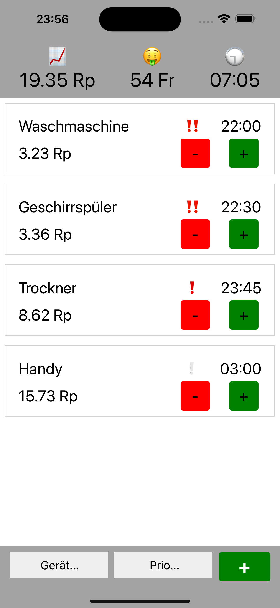

# SICSMART - Smart Timer 

This project aims to develop a mobile app for Swiss households.
Not all Swiss homes have smart devices, and this app will encourage efficient electricity use to avoid network overloads, reduce reliance on costly foreign energy, and tackle peak power costs.
It will also serve as a hub for user communication and future sustainability projects.

## Details 🔍

**Scope**


The scope of the project involves an examination of the basic tariff system using the example of the city of Zurich (EWZ).

For tariff data, a static database will serve as the data source within the framework of the Proof of Concept (POC).

The app will be implemented as a Minimum Viable Product (MVP).

Due to time constraints, the actual use of the application by users will not be verified.

Additionally, because of the time constraints and in compliance with the revised Data Protection Act (DSG), no user statistics will be collected through the "App."

**Planned Features**

**User Functions**

The following are the main use cases for the Smart Timer
* The user can see in which tariff he is and how much it costs
* The user can see how much money he has saved with the help of the Smart Timer
* The user can see when the tarif will change
* The user can add devices and priorities
* The user can cancel or validate the use of the added devices

<br >

## Screenshots 📸

| Page                                                                          | Description                                                                  |
|:------------------------------------------------------------------------------|:-----------------------------------------------------------------------------|
|  <br/> Landing Page                 | The Landing Page is the first Page that the user sees, once he opens the App |

<br >

# Documentation 📚

There is no Documentation yet

## Techstack and Tools 🧰

* [Reacte](https://reactnative.dev/)
* [Figma](https://www.figma.com/)
* [Webstorm](https://www.jetbrains.com/idea/)
* [Android Development](https://developer.android.com/)


<br >

## Possible Future Extension 💡

**APIs**

Using APIs from the electricity supplier to better manage the times to use the devices.

**Time Picker**

The user should be able to pick a time slot at which he can use the devices, and the smart timer will decide what the best time is to use the device.

# Security 👮

If you discover any security related issues, please use the issue tracker instead of sending a mail.

# Branching Model and Naming 🌿

We use a simplyfied version of
the [Gitflow](https://www.atlassian.com/de/git/tutorials/comparing-workflows/gitflow-workflow) workflow.

| Name        | Description                                                                                                                                                                                                                                                                                                        |
|:------------|:-------------------------------------------------------------------------------------------------------------------------------------------------------------------------------------------------------------------------------------------------------------------------------------------------------------------|
| `main`      | The master branch contains the production code and stores the official release history.                                                                                                                                                                                                                            |
| `develop`   | The develop branch contains pre-production code and serves as an integration branch for features                                                                                                                                                                                                                   |
| _`feature`_ | Each new feature should reside in its branch, which can be pushed to the central repository for backup/collaboration. Feature branches use the latest develop as their parent branch. When a feature is complete, it gets merged back into develop. Features should never interact directly with the master branch |

<div align="center">


</div>

As for the naming of the feature branches, we use the following convention:
`<issue-id>-<issue-name>[-<short-description>]`

# Commit Messages 📝

The following section is a must. It is a good practice to write a commit message in the
following format:

```
Format:
<type>(<scope>): <subject> [<issue number>]

Example:
feat(Save Button): Implemented save button [MF-1]
```

The following types should be used:

* ci: Changes to our CI configuration files and scripts
* docs: Documentation only changes
* feat: A new feature
* fix: A bug fix
* refactor: A code change that neither fixes a bug nor adds a feature
* style: Changes that do not affect the meaning of the code (white-space, formatting, missing semi-colons, etc)
* test: Adding missing tests or correcting existing tests

_For more information, please refer to
the [Angular Commit Message Guidelines](https://www.conventionalcommits.org/en/v1.0.0/)_

# Versioning 📌

We make it easy for you to keep track of the versions of our project. For transparency into our release cycle and in
striving to maintain backward compatibility, we will be adhering to [Semantic Versioning](http://semver.org/) guidelines
whenever possible.

# Acknowledgements 🙏

A big thank you to all the people who have contributed to this project. We are very grateful for your support and help,
especially to the open source community.

- [Awesome Readme Templates](https://awesomeopensource.com/project/elangosundar/awesome-README-templates)
- [Awesome README](https://github.com/matiassingers/awesome-readme)
- [How to write a Good readme](https://bulldogjob.com/news/449-how-to-write-a-good-readme-for-your-github-project)
- [Shields.io](https://shields.io/)
- [Ich danke Gott, meiner Familie und Freunden. Und den Rest verdank ich 5, 6 Leuten.](https://genius.com/4160880)

# Authors 🪶
Build with ❤️ by
- [@armandoshala](https://www.github.com/armandoshala) (shalaar3)
- [@BadrOutiti](https://www.github.com/BadrOutiti) (outitbad)
- [@omerasipi](https://www.github.com/omerasipi) (asipiome)
- [Riccardo Widmer]() (No ZHAW Name yet)

# Contributing 🤝

This project was created for the course "SIC Smart Living" at the University of Applied Sciences in Zurich.
Since the course is over, we will not be able to maintain this project. However, we will be happy to accept any
contributions that you may have.
Feel free to fork or clone this repository as long as you obey the License (Please refer to the license section for more information.)

# Support ⭐

If you like our project, please consider supporting us by giving a ⭐ on our project!

# License 📜

Smart Timer is distributed under the terms of the [Apache License (Version 2.0)](https://www.apache.org/licenses/LICENSE-2.0).

